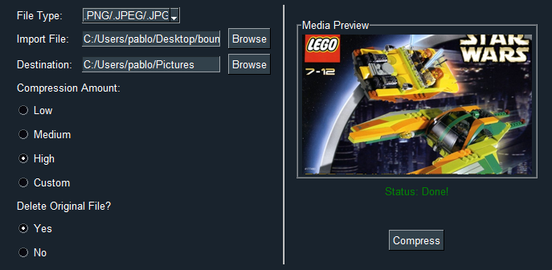

# Kompaktor

Kompaktor is a lightweight desktop utility that compresses images, videos, and PDFs with customizable quality settings to save disk space.

---

---

## Installation

You can install Kompaktor in two ways:

1. **Standalone Executable**: Download and run `Kompaktor.exe` from the [releases page](https://github.com/pedicino/Kompaktor/releases) - no installation required.

2. **From Source**: Clone this repository and run `scMain.py` with Python (requires dependencies).

## Features

- Compress PNG, JPEG, JPG, MP4, and PDF files
- Multiple compression levels (Low, Medium, High, or Custom)
- Media preview for images
- Option to delete original files after compression
- Simple, user-friendly interface

## Dependencies

If running from source, you'll need:
- Python 3.8+
- PySimpleGUI
- Pillow (PIL)
- FFmpeg (for video compression)
- Ghostscript (for PDF compression)

## License

[MIT License](https://github.com/pedicino/Kompaktor/blob/main/LICENSE)
